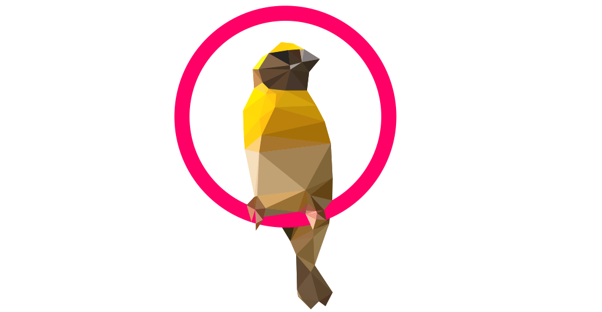

# Baya
A basic layout framework for Swift.

## Features

- *Baya* uses structs to create a tree graph of layout rules. 
- Nested layouts without a nested view hierachy. 
- Simple and readable layout code.
- Extendable.
- Works without Interface Builder or Auto Layout.


## Installation

#### Carthage

Add the following to your `Cartfile`
```
github "getwagit/Baya" ~> 1.0.0
```


## Usage
A basic user profile layout could be defined with *Baya* like this:

```swift
...
var layout: BayaLayoutable?

override func loadView() {
  ...
  // Add subview directly as sub view to the ViewControlles's root view.
  view.addSubView(profilePicture)
  ...

  // Create your layout graph. In this case it is just a linear layout.
  layout = [profilePicture, userName, friendCount].layoutLinear(orientation: .horizontal)
}
```
Run your layout by calling `layoutWith`. In a `ViewController` the method `viewWillLayoutSubviews` is probably the best place to do this.
```swift
override func viewWillLayoutSubviews() {
  // Apply the layout.
  layout?.layoutWith(frame: view.bounds)
}
```
This is what a layout graph might look like:
```swift
let buttonRowLayout = [button1, button2, button3]
  .layoutLinear(
    orientation: .horizontal,
    spacing: 20)

let pictureLayout = profilePicture
  .layoutFixedSize(
    width: 100,
    height: 100)
  .layoutGravitate(to: .center)

let usernameLayout = nameLabel
  .layoutGravitate(to: .center)

layout = [pictureLayout, usernameLayout, buttonRowLayout]
  .layoutLinear(orientation: .vertical)
```

## Docs
For a list of all layout methods check out the wiki!


## License 
Baya is available under the MIT license.


